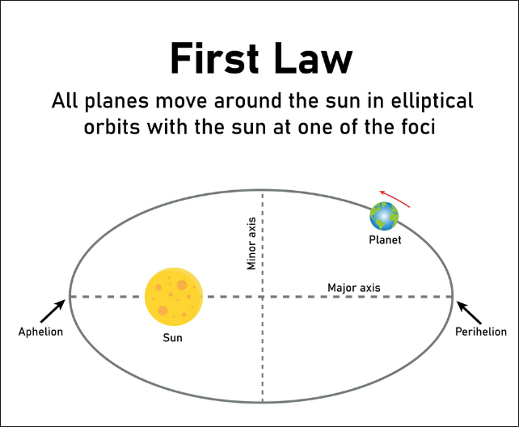
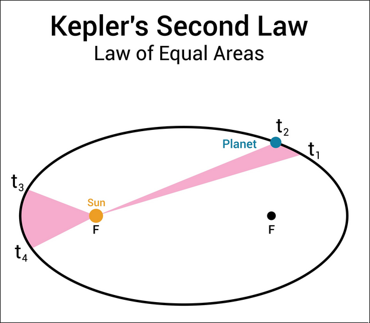

Selvfølgelig. Her er en "cheat sheet" til Keplers tre love, fokuseret på præcis det, du skal bruge til opgaveløsning.

De beskriver, hvordan planeter bevæger sig om stjerner (og måner om planeter).

---

### 1. Keplers Første Lov (Ellipeloven)
**Hvad den siger:**
Planeter bevæger sig ikke i perfekte cirkler, men i **ellipser**, med stjernen i det ene af de to brændpunkter (fokus).

**Hvad den bruges til i opgaver:**
* **Teori-spørgsmål:** Hvis du bliver spurgt om banens form.
* **Afstand:** Den fortæller dig, at afstanden mellem planeten og stjernen *varierer*.
    * Tættest på kaldes *perihelium*.
    * Længst væk kaldes *aphelium*.
* *Bemærk:* I mange regneopgaver (som den du lige lavede) "snyder" man lidt og antager, at banen er en cirkel ($e \approx 0$) for at gøre matematikken lettere.

---

### 2. Keplers Anden Lov (Arealloven)
**Hvad den siger:**
En linje trukket fra stjernen til planeten overstryger **lige store arealer i lige store tidsrum**.

**Hvad den bruges til i opgaver:**
* **Hastighed:** Dette er nøglen til at forstå planetens fart.
    * Når planeten er **tæt** på stjernen, skal den bevæge sig **hurtigt** for at dække arealet.
    * Når planeten er **langt** fra stjernen, bevæger den sig **langsomt**.
* **Typisk spørgsmål:** "Bevæger planeten sig hurtigst i punkt A eller B?" (Svar: Der hvor den er tættest på stjernen).

---

### 3. Keplers Tredje Lov (Den Harmoniske Lov)
**Hvad den siger:**
Der er en fast sammenhæng mellem hvor lang tid et omløb tager ($T$), og hvor langt væk planeten er ($a$ eller $r$).
$$T^2 \propto a^3$$
*(Kvadratet på omløbstiden er proportional med kubus på den halve storakse).*

**Hvad den bruges til i opgaver (VIGTIGST):**
Dette er "regne-loven". Du møder den i to udgaver:

**Udgave A: Sammenligning (Forholdstal)**
Bruges når du kender én planet og skal finde noget om en anden i samme system.
$$\frac{T_1^2}{a_1^3} = \frac{T_2^2}{a_2^3}$$
* *Eksempel:* "Jorden har afstand 1 AU og tid 1 år. En ny planet har afstand 4 AU. Hvad er dens omløbstid?"

**Udgave B: Newtons udgave (Den du brugte før)**
Bruges når du kender massen på stjernen ($M$) og skal finde $T$ eller $r$.
$$T^2 = \frac{4 \cdot \pi^2}{G \cdot M} \cdot r^3$$
* *Eksempel:* Opgaven du lige løste med planetforskeren. Her indgår tyngdekraftkonstanten $G$.

---

### Kort opsummering til eksamen:

1.  **Form:** Banen er en ellipse (Stjernen er ikke i midten, men i et fokus).
2.  **Fart:** Planeten er hurtigst, når den er tættest på stjernen.
3.  **Matematik:** $T^2$ hænger sammen med $r^3$. (Stor afstand = Lang omløbstid).
